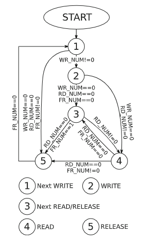

<div id="top"></div>

<br />

<div align="center">
  <a href="https://github.com/nim-works/nimskull">
    
  </a>

  <p align="center">
    Multi-threaded synchronisation state machine.
    <br />
    <br />
  </p>
</div>

<br />

> Pure nim implementation of the synchronisation object proposed by Mariusz Orlikowski in 'Single Producer - Multiple Consumers Ring Buffer Data Distribution System with Memory Management'

Implementation of a lock that allows multiple readers, one writer, and a special write state
for freeing. It is only 8 bytes large making it incredibly memory efficient.

Using futexes makes this primitive truly faster and more efficient than mutexes for its
use case.

## Documentation

[The documentation is kept up to date and is generated from the source.](https://shayanhabibi.github.io/wrflock/wrflock.html)

<p align="right">(<a href="#top">back to top</a>)</p>

## Principle

A thread will acquire the capability to perform an action (write, read, free)
and then **wait** for that action to be allowed. Once the thread has completed
its action, it then releases the capability which will then allow the following
action to be completed.

<details><summary><b>Principally, the wrflock is a state machine.</b></summary><br />
<div align="center">



</div>
</details>

<p align="right">(<a href="#top">back to top</a>)</p>


## Use Cases

This is especially useful in parallel IO consumption. The IO thread will attain
the writer state and write to a shared memory location. Multiple readers can
consume this; a specialised thread for deallocation will wait on the free action
which is allowed when all reads have released the lock to deallocate/cleanse the
memory (or simply allow the write to proceed) before allowing the next write to
execute.

<p align="right">(<a href="#top">back to top</a>)</p>

## Usage

> **Note: the api has not been finalised and is subject to change**

Example is for write, the same can be done for read and free by changing the
prefix letter.

```nim
let lock = initWRFLock()

if lock.wAcquire(): # all operations return bools; they are discardable if you
                    # know what you're doing.
  lock.wWait()
  # do write things here
  lock.wRelease()
```

Alternative waits can be used.

```nim
let lock = initWRFLock()

if lock.wAcquire():
  while not lock.wTryWait():
    # Do other things while the thread waits to perform its action
  # Do write things here
  lock.wRelease()
```

```nim
let lock = initWRFLock()

if lock.wAcquire():
  while not lock.wWait(1_000):
    # Do other things if the lock times out waiting for its action
  # Do write things here
  lock.wRelease()
```

> **NOTE:** the behaviour of TimeWait is different between the yield and blocking
> locks. Yield TimeWaits will always complete after the allotted time. Blocking TimeWaits can actually wait longer than the allotted time. It is guaranteed to
> either eventually succeed or time out.

---

### Alternative API

```nim
let lock = initWRFLock()

if lock.acquire(Write):
  while not lock.wait(Write, 1_000):
    # Do other things if the lock times out waiting for its action
  # Do write things here
  lock.release(Write)
```

---

By default, the Wait operations for all 3 actions (write, read, free) are blocking
using a futex. You can pass flags to change this to just have the thread yield
to the scheduler for any of the actions.

```nim
let lock = initWRFLock({WriteYield, ReadYield, FreeYield})
```

Convenience templates and extra procedures such as setFlags can be found in the
documentation.

<p align="right">(<a href="#top">back to top</a>)</p>
